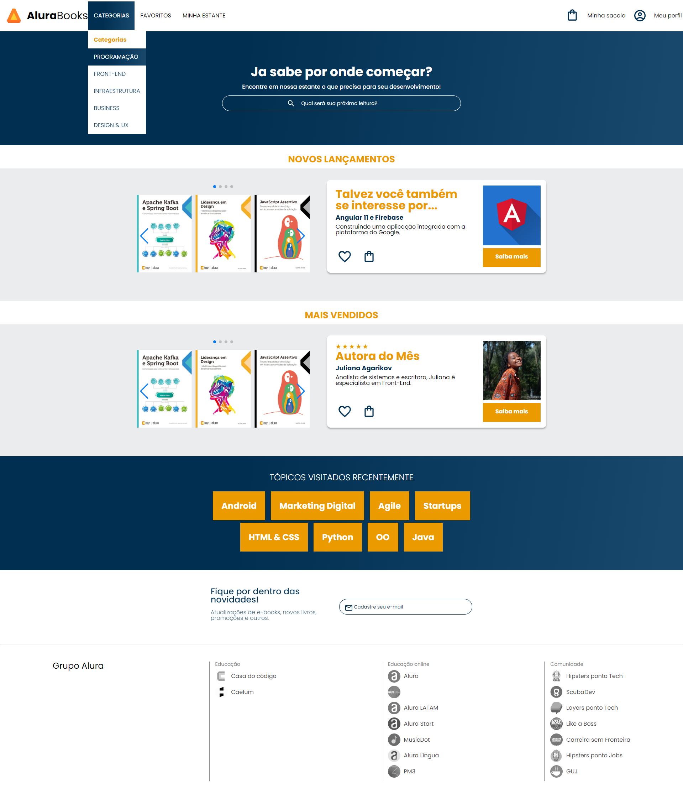

# projeto alura books
 Projeto mobile-first feito com a Alura na formação HTML e CSS : Responsividade mobile-first

## Objetivo do projeto
Praticar CSS

## Link relacionado
### [🔗Clique para acessar o projeto](https://ngemir.github.io/projeto-alura-books/)

 [<h3>
 Figma</h3>](https://www.figma.com/file/sSMbIqKaGBd66Y8roxTk2p/AluraBooks)
